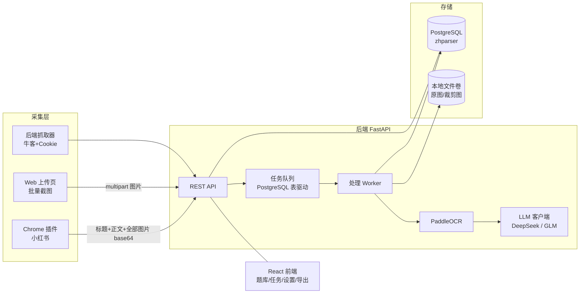

# 面经整理平台 · 系统设计文档

> 版本：v1.0 ｜ 日期：2026-09-14 ｜ 状态：待评审
>
> 技术栈：React (Vite + TypeScript + Ant Design) + FastAPI + PostgreSQL (zhparser) + PaddleOCR + DeepSeek/GLM

---

## 1. 项目概述

### 1.1 目标

个人自用的面经整理平台：

1. 从小红书、牛客等平台**采集**面经帖（Chrome 插件 / 服务端抓取 / 手动上传截图）；
2. **保留原始来源**：每条题目都可追溯原帖链接、原帖截图；
3. 将帖内（主要是截图中的）题目自动整理成**一题一记录**的规范题库，题目带答案；
4. 支持中文全文搜索、在线修订、Markdown 导出。

### 1.2 关键决策记录（已与需求方确认）

| 决策点 | 结论 |
|---|---|
| 采集入口 | ① Chrome 插件（Manifest V3，只管小红书）② 牛客"贴链接→服务端抓取"（支持配置个人 Cookie）③ 批量粘贴/拖入截图（保底） |
| 版权边界 | 平台只展示"题目 + 答案 + 原帖链接"，不转载原帖正文 |
| 题目粒度 | 每道独立题目 = 一条记录；**不合并**跨帖同题（同一题在 10 个帖子 = 10 条记录，各带来源） |
| 答案来源 | 原帖自带答案 → 保留并标注"来自原帖"；没有 → LLM 生成参考答案，标注"AI 生成" |
| 答案风格 | 面试口述版：3-5 个分点 + 之后的长文解释；手撕代码题 = 思路讲解 + 代码块（前端语法高亮）；场景设计题 = 分点论述 |
| 提准措施 | 视觉模型复核（低置信度图换 GLM-4V 直读）+ JSON Schema 结构化自检（不合规自动重试）+ 帖内相同题干合并 + 事后修订界面 |
| 自动化程度 | OCR → 抽题 → 入库**全自动**，不设人工确认阻断；提供事后编辑 |
| 元数据 | 公司、岗位方向、面试轮次、题型（八股/手撕代码/场景设计/项目深挖）、置信度、处理时间 |
| 原图存档 | 保留原帖整图 + 每道题的截图裁剪区域 |
| 搜索 | PostgreSQL + zhparser 中文分词全文搜索；范围 = 题干 + 答案 + 公司/方向标签 |
| 不要的功能 | 复习/刷题模式、频率统计、收藏（均不做）；**要** Markdown 数据导出 |
| 部署 | 本机 Docker Compose：PostgreSQL + FastAPI 后端 + 前端静态服务 |
| LLM 分工 | DeepSeek：文本抽题 + 答案生成（主力）；GLM-4V：低置信度图片视觉复核；GLM 文本模型：备用 |
| OCR | PaddleOCR 本地运行（CPU） |
| 规模 | 1~2 万条题目，单用户 |

---

## 2. 总体架构



```text
（文字版拓扑，与上图等价）

浏览器（已登录小红书）
 └─ Chrome 插件：读取帖子数据层 __INITIAL_STATE__，浏览器内下载全部轮播图，
    打包 POST http://localhost:8000/api/ingest/xhs
本地浏览器
 └─ Web 上传页：批量拖入/粘贴截图 → POST /api/ingest/images (multipart)
FastAPI 容器
 ├─ API 层：接收采集载荷 → 建源帖记录 + 源图记录 + 处理任务（状态机）
 ├─ Worker：任务循环 下载存档 → PaddleOCR → 置信度判定
 │    ├─ 低置信度 → GLM-4V 直接看图抽题
 │    └─ 正常 → DeepSeek 按 OCR 文本抽题
 │   → JSON Schema 校验（失败自动重试，最多 3 次）
 │   → 帖内相同题干合并 → 生成/提取答案 → 入库
 ├─ 牛客抓取器：requests/httpx + 用户配置的 Cookie 抓帖子正文
 └─ 文件存储：/data/images/{post_id}/...
PostgreSQL 容器
 └─ 业务表 + zhparser 全文索引
前端容器（nginx 托管构建产物）
 └─ 任务中心 / 题库列表 / 题目详情(编辑) / 搜索 / 上传 / 设置 / 导出
```

### 2.1 组件与端口

| 组件 | 端口 | 说明 |
|---|---|---|
| `frontend` (nginx) | 8080 → 宿主 | 托管 React 构建产物，反代 `/api` 到后端 |
| `backend` (FastAPI) | 8000 → 宿主 | REST API + Worker（同容器内后台协程） |
| `postgres` | 不暴露宿主（可选 5432） | 基于 PostgreSQL 镜像构建，含 zhparser 扩展 |

> 队列选型说明：为控制组件数量，任务队列用 **PostgreSQL 表 + `FOR UPDATE SKIP LOCKED`** 实现，Worker 以 asyncio 后台任务形式跑在 FastAPI 进程内（Uvicorn 单实例，满足单用户吞吐）。未来如需拆分，Worker 可独立成进程而不改表结构。

---

## 3. 采集层设计

### 3.1 Chrome 插件（小红书，Manifest V3）

**职责**：在用户已登录的浏览器里，一键采集当前打开的小红书面经帖。

**采集内容**（打包为一个"待处理任务"）：

```jsonc
// POST /api/ingest/xhs
{
  "url": "https://www.xiaohongshu.com/explore/xxxx",
  "title": "字节跳动 后端一面面经",
  "desc": "帖子正文文字…",
  "author": "某某",
  "published_at": "2026-09-01",
  "tags": ["面经", "后端"],
  "images": [
    { "index": 0, "filename": "0.jpg", "data_base64": "…", "width": 1080, "height": 1440 }
  ]
}
```

**关键实现点**：

1. **图片获取不走服务端**：小红书图片 CDN（`sns-img`）有 Referer 防盗链，服务端直连可能 403。插件在浏览器上下文里 `fetch` 图片 → `FileReader` 转 base64 → 随任务上传，后端只存不下载。
2. **突破轮播懒加载**：Content Script 优先解析页面数据层 `window.__INITIAL_STATE__`（含全部图片 URL，无需滑动）；解析失败则回退为"自动模拟滑动轮播 + DOM 收集"。
3. **触发方式**：手动点击插件按钮才采集（不自动抓取浏览记录）；popup 显示采集进度和结果（成功/失败/图片张数）。
4. **后端地址可配置**：popup 里可设置 API 地址（默认 `http://localhost:8000`），方便以后迁到服务器；鉴权用简单 Bearer Token（设置页生成）。

**目录结构**：

```text
extension/
├── manifest.json          # MV3，权限: activeTab, scripting, storage; host_permissions: xiaohongshu.com/*
├── background.js          # service worker：接收 content script 数据 → fetch 上传后端
├── content.js             # 解析 __INITIAL_STATE__ / DOM，下载图片转 base64
├── content.css            # 采集进度提示角标
└── popup/
    ├── popup.html / popup.js / popup.css   # 按钮、后端地址与 Token 设置、结果显示
```

### 3.2 牛客服务端抓取

- 入口：Web 上传页贴链接 → `POST /api/ingest/niuke { "url": "…" }`。
- 实现：`httpx` 请求帖子页/接口，解析正文文字与帖内图片（牛客图片 CDN 无强制 Referer 校验，服务端可下载）。
- **Cookie 配置**：设置页粘贴个人 Cookie（应对需登录的帖子），存于 `settings` 表，抓取时携带；只在后端使用，不回传前端明文（前端显示打码）。
- 抓取结果同样进入"源帖 + 源图 + 任务"的统一管线。

### 3.3 批量截图上传（保底入口）

- Web 上传页支持**拖拽 / Ctrl+V 粘贴多张图片**，一次提交。
- 提交即创建一个 `platform=manual` 的源帖记录（`url=null`），每张图一条源图记录，任务自动排队。
- 界面为任务队列模式：提交 → 自动处理 → 完成后展示结果列表（每张图对应的抽题结果、置信度）；失败任务提供**重试按钮**。

---

## 4. 处理管线（核心）

### 4.1 任务状态机

```text
pending → processing → done
              ├→ done_with_warnings（有低置信度题目，仍入库）
              └→ failed（可手动重试；重试计数 +1，上限 5 次）
```

任务表记录：类型（xhs/niuke/manual）、载荷引用、每阶段状态与耗时、错误信息、重试次数。

### 4.2 处理步骤

| 步骤 | 内容 | 输出 |
|---|---|---|
| 1. 落盘存档 | base64/下载的原图写入 `/data/images/{post_id}/{index}.jpg` | 原图路径 |
| 2. OCR | PaddleOCR（CPU，`lang=ch`）逐图识别；记录每行文本框坐标 + 置信度 | 全文 + 行级明细 |
| 3. 降噪 | 过滤水印、页脚、点赞/收藏等 UI 文本（按坐标与关键词规则） | 干净文本 |
| 4. 路由判定 | 图片平均 OCR 置信度 < 阈值（默认 0.85）**或**文本含代码/公式特征 → 走视觉模型 | 路由决策 |
| 5a. 文本抽题 | DeepSeek：输入"帖子标题+正文+OCR 文本"，按 §4.3 Schema 输出题目数组 | 候选题 JSON |
| 5b. 视觉抽题 | GLM-4V 直接读原图（附 OCR 文本辅助），同 Schema 输出 | 候选题 JSON |
| 6. Schema 自检 | pydantic 校验；失败则带错误信息重试同一模型，最多 3 次；仍失败标记任务 failed | 合法题目数组 |
| 7. 帖内去重 | 同帖内题干完全相同（归一化后）合并为一条 | 题目数组 |
| 8. 答案处理 | 题目附带原帖答案 → `answer_source=original`；否则 DeepSeek 生成 → `answer_source=ai` | 答案 Markdown |
| 9. 入库 | 写 `questions` 表；生成元数据（公司/方向/轮次/题型）；文本框坐标并集 → 裁剪图存档 | 题目记录 |
| 10. 索引 | 触发 tsvector 列更新（生成列自动） | 全文可搜 |

### 4.3 LLM 输出 Schema（抽题）

```jsonc
{
  "questions": [
    {
      "content": "讲讲 MySQL 的 MVCC 实现原理",
      "question_type": "eight_legged",        // 八股 | handwritten_code 手撕代码 | scenario 场景设计 | project 项目深挖
      "answer_in_post": "原帖中紧跟的答案文本，没有则 null",
      "answer_full": "原帖答案完整段落（含追问回答），没有则 null",
      "follow_ups": ["追问1", "追问2"],        // 面试官追问，合并进本题
      "company": "字节跳动",
      "direction": "后端",
      "interview_round": "一面",
      "source_image_indexes": [0, 1],          // 该题出现在哪几张图
      "source_text_spans": ["MVCC 就是…"],      // OCR 原文引用，用于裁剪定位与人工核对
      "confidence": 0.92                       // 模型自报置信度 0~1
    }
  ]
}
```

- 校验规则（pydantic）：`content` 非空且 ≥ 4 字；`question_type` 必须为枚举值；`source_image_indexes` 必须存在；`answer_in_post` 与 `answer_full` 不同时为有值时内容一致。
- **裁剪图生成**：取该题 `source_text_spans` 在 OCR 行级明细中命中的文本框坐标，做外扩（上下各 +20px）裁剪存档；视觉模型路径下由 GLM-4V 返回题目的包围盒（`bbox` 字段）。

### 4.4 答案生成规范（AI 参考答案）

- 结构：**面试口述版**（3-5 个分点，可直接背）+ `---` 分隔 + **长文解释**（展开原理、对比、示例）。
- 手撕代码题：思路讲解（含复杂度）+ 代码块（标注语言，前端 highlight.js 语法高亮）+ 常见追问。
- 场景设计题：需求澄清 → 方案分点论述 → 权衡取舍。
- 生成时带指令："这是面经语境，答案用于面试准备，请用中文，分点清晰，不要客套话。"
- 全部 AI 答案强制 `answer_source=ai`，前端以徽标区分"来自原帖 / AI 生成"。

### 4.5 准确率保障汇总

| 措施 | 作用 |
|---|---|
| 视觉模型复核路由 | OCR 差图（手写、截图糊、代码公式）换 GLM-4V 直读，绕开 OCR 误差 |
| JSON Schema 自检 + 重试 | 杜绝格式坏数据入库；解析失败自动重试 3 次 |
| 帖内相同题干合并 | 防止同帖重复入库 |
| 置信度标记 | 任务级/题目级置信度透明展示，低置信度题目列表内高亮，便于事后修订 |
| 事后修订界面 | 题干/答案/元数据全部可编辑，修正不阻断主流程 |

---

## 5. 数据模型

### 5.1 ER 概览

```mermaid
erDiagram
    source_post ||--o{ source_image : "1:N"
    source_post ||--o{ ingest_task : "1:1..N"
    source_image ||--o{ question : "1:N"
    question }o--|| source_post : "belongs to"

    source_post {
        bigint id PK
        text platform "xhs | niuke | manual"
        text url "可空"
        text title
        text author
        timestamptz published_at
        text raw_text
        timestamptz created_at
    }
    source_image {
        bigint id PK
        bigint post_id FK
        int index
        text file_path
        text ocr_text
        float ocr_confidence
        jsonb ocr_lines "行级坐标+置信度"
        timestamptz created_at
    }
    question {
        bigint id PK
        bigint post_id FK
        bigint image_id FK "主来源图"
        text content "题干"
        text question_type "enum"
        text answer_markdown
        text answer_source "original | ai"
        text company
        text direction
        text interview_round
        text source_url
        text crop_image_path "可空"
        float confidence
        tsvector search_vector "生成列"
        timestamptz created_at
        timestamptz updated_at
    }
    ingest_task {
        bigint id PK
        bigint post_id FK
        text task_type
        text status "pending|processing|done|done_with_warnings|failed"
        int retry_count
        text error_message
        jsonb stage_stats
        timestamptz created_at
        timestamptz finished_at
    }
    app_setting {
        text key PK "如 niuke_cookie, api_token, llm_keys"
        text value "敏感值加密/服务端持有"
        timestamptz updated_at
    }
```



### 5.2 要点

- `question.search_vector`：`tsvector` 生成列，`to_tsvector('zhparser', content || answer_markdown || company || direction)`，GIN 索引。
- 题干归一化函数（去空白/全半角）用于帖内去重。
- 图片与裁剪图存文件系统（Docker 卷 `./data/images`），DB 只存路径；删除源帖级联删除文件（Worker 异步清理）。
- 所有表带 `created_at/updated_at`；软删除（`deleted_at`）用于题目，防误删。

---

## 6. API 设计

Base URL：`http://localhost:8000/api`；鉴权：本机部署默认免鉴权，可开启 Bearer Token（`settings` 中配置，插件与前端均携带）。

### 6.1 采集

| 方法 | 路径 | 说明 |
|---|---|---|
| POST | `/ingest/xhs` | 插件上传：标题/正文/图片 base64 等，创建源帖+任务 |
| POST | `/ingest/niuke` | `{url}`，服务端抓取（用配置 Cookie） |
| POST | `/ingest/images` | multipart 多文件，创建 manual 源帖+任务 |
| GET | `/tasks?status=&page=` | 任务列表（状态、进度、错误） |
| POST | `/tasks/{id}/retry` | 重试失败任务 |
| GET | `/tasks/{id}` | 任务详情（阶段统计） |

### 6.2 题库

| 方法 | 路径 | 说明 |
|---|---|---|
| GET | `/questions` | 分页列表；过滤：公司/方向/轮次/题型/答案来源/置信度区间/任务/关键词 |
| GET | `/questions/{id}` | 详情（含来源帖、原图、裁剪图 URL） |
| PATCH | `/questions/{id}` | 编辑题干/答案/元数据（事后修订） |
| DELETE | `/questions/{id}` | 软删除 |
| GET | `/search?q=…&filters…` | zhparser 全文搜索，返回高亮片段与排名 |

### 6.3 系统

| 方法 | 路径 | 说明 |
|---|---|---|
| GET/PUT | `/settings` | 牛客 Cookie、API Token 开关、LLM key、模型路由参数（阈值等） |
| GET | `/export?format=md&filters…` | 导出 Markdown（按过滤条件），流式下载 |
| GET | `/health` | 健康检查 |

**导出 Markdown 格式**（每题一节）：

```markdown
## [八股] 讲讲 MySQL 的 MVCC 实现原理

- 公司：字节跳动 ｜ 方向：后端 ｜ 轮次：一面
- 来源：[原帖](https://www.xiaohongshu.com/explore/xxxx) ｜ 答案来源：AI 生成

### 答案（口述版）
- …
- …

### 长文解释
…
```

---

## 7. 前端设计（React + Vite + TS + Ant Design）

### 7.1 页面结构

| 路由 | 页面 | 核心内容 |
|---|---|---|
| `/ingest` | 上传 | 拖拽/粘贴批量图片、贴牛客链接、插件使用说明；提交后跳任务 |
| `/tasks` | 任务中心 | 任务列表（状态徽标、进度、耗时）、失败重试、结果跳转 |
| `/questions` | 题库列表 | 表格：题干摘要/题型/公司/方向/轮次/答案来源徽标/置信度；多维筛选；低置信度高亮 |
| `/questions/:id` | 题目详情 | 题干+答案渲染（Markdown + 代码高亮）、口述版/长文折叠、来源链接、原图与裁剪图查看器、**全部字段行内编辑** |
| `/search` | 搜索 | 大搜索框 + 结果高亮片段 + 筛选联动 |
| `/settings` | 设置 | 牛客 Cookie、Token 开关、LLM key、阈值参数 |
| `/export` | 导出 | 选过滤条件 → 下载 .md |

### 7.2 技术要点

- 请求层：`ky`（或 axios）+ TanStack Query（缓存/失效）；状态：URL search params 优先 + 轻量 zustand。
- Markdown 渲染：`react-markdown` + `remark-gfm` + `rehype-highlight`（代码高亮）。
- 图片查看：`antd Image.PreviewGroup`（原图/裁剪图切换）。
- 组件风格：AntD 5，暗色/亮色跟随系统；所有表格列可开关。

---

## 8. 后端工程结构（FastAPI）

```text
backend/
├── app/
│   ├── main.py               # FastAPI 实例、路由挂载、Worker 启动
│   ├── config.py             # Pydantic Settings（env）
│   ├── db.py                 # SQLAlchemy async engine/session
│   ├── models/               # ORM 模型（post/image/question/task/setting）
│   ├── schemas/              # Pydantic IO 模型 + LLM 抽题 Schema
│   ├── api/                  # ingest / tasks / questions / search / settings / export
│   ├── services/
│   │   ├── queue.py          # PostgreSQL SKIP LOCKED 任务领取
│   │   ├── worker.py         # 管线编排（状态机）
│   │   ├── ocr.py            # PaddleOCR 封装 + 行级明细
│   │   ├── llm/
│   │   │   ├── deepseek.py   # 文本抽题/答案生成
│   │   │   ├── glm.py        # GLM-4V 视觉复核 + 文本备用
│   │   │   └── prompts.py    # 抽题/答案 Prompt 模板
│   │   ├── cropper.py        # 裁剪图生成
│   │   ├── exporters/md.py   # Markdown 导出
│   │   └── scrapers/niuke.py # 牛客抓取器（httpx + cookie）
│   └── utils/                # 归一化、图片校验、敏感值处理
├── tests/                    # pytest：Schema 校验/管线 mock/API
├── Dockerfile
└── requirements.txt
```

- Python 3.11；SQLAlchemy 2.0 async + asyncpg；PaddleOCR CPU 版同容器安装。
- LLM 调用统一走 OpenAI 兼容接口（DeepSeek/GLM 均提供），便于换供应商；超时/限速/重试封装。
- 密钥管理：`.env` 提供 DeepSeek/GLM key；牛客 Cookie 走设置页（DB 存储，接口返回打码）。

---

## 9. 部署（Docker Compose）

```yaml
# docker-compose.yml（示意）
services:
  postgres:
    build: ./docker/postgres-zhparser   # postgres 官方镜像 + 编译 zhparser
    environment: [POSTGRES_DB=mianjing, POSTGRES_USER=app, POSTGRES_PASSWORD=...]
    volumes: [pgdata:/var/lib/postgresql/data]
  backend:
    build: ./backend
    env_file: .env
    volumes: [./data:/app/data]
    depends_on: [postgres]
    ports: ["8000:8000"]
  frontend:
    build: ./frontend        # 多阶段：node build → nginx 托管 + /api 反代
    ports: ["8080:80"]
    depends_on: [backend]
volumes: { pgdata: {} }
```

- `docker/postgres-zhparser/Dockerfile`：基于 `postgres:16`，源码编译 `zhparser + scws`（构建一次，后续走镜像缓存）。
- 数据卷：`./data`（图片）、`pgdata`（库）；`.env` 存密钥（gitignore）。
- 一键启动：`docker compose up -d --build`；初始化 SQL（扩展 + 表）由后端启动迁移（Alembic）执行。

---

## 10. 分期实施计划

| 阶段 | 内容 | 验收标准 |
|---|---|---|
| **P1 基础管线（MVP）** | Compose 环境 + 数据库 + FastAPI 骨架 + **批量截图上传 → OCR → DeepSeek 抽题 → 答案生成 → 题库列表/详情/编辑 + 全文搜索 + MD 导出** | 拖入 10 张面经截图，自动产出题目并可搜索、可导出 |
| **P2 Chrome 插件** | MV3 插件：小红书采集（数据层解析 + 懒加载兜底）→ `/ingest/xhs` | 在小红书面经帖点按钮，全部轮播图入库抽题成功 |
| **P3 牛客抓取 + 打磨** | 牛客贴链接抓取 + Cookie 设置 + 视觉模型复核路由 + 裁剪图 + 任务重试细节 | 牛客链接一键入库；低置信度图走 GLM-4V 且结果更优 |

每阶段结束跑一遍真实面经样本回归（准备 20 张典型截图作测试集）。

---

## 11. 风险与对策

| 风险 | 影响 | 对策 |
|---|---|---|
| 小红书前端改版（`__INITIAL_STATE__` 失效） | 插件采不到图 | 插件内置 DOM 滑动兜底；解析器做成可配置选择器，改版只改插件 |
| OCR 对代码/手写识别差 | 题目错漏 | 低置信度自动路由 GLM-4V 直读；裁剪图留档供人工核对 |
| LLM 幻觉（编造不存在的题） | 数据污染 | Prompt 要求"只输出原文明确出现的题"+ `source_text_spans` 引用校验（引用命不中 OCR 文本的题降置信度并标记） |
| 牛客反爬升级 | 抓取失败 | Cookie 方案 + 请求频率控制；失败任务可见可重试；保底手动复制粘贴文本 |
| API 费用失控 | 成本 | 视觉复核仅低置信度触发；任务级 token 用量统计展示在任务详情 |
| 单文件卷损坏 | 数据丢失 | `pgdata` 与 `./data` 均在宿主目录，便于 Time Machine/脚本备份；导出 MD 即逻辑备份 |

---

## 12. 待办确认

- [ ] DeepSeek / GLM 的 API Key 准备好（`.env` 用）
- [ ] 插件以"开发者模式加载"方式安装（不上架商店）
- [ ] P1 开发顺序确认：数据库迁移 → 管线 → API → 前端
